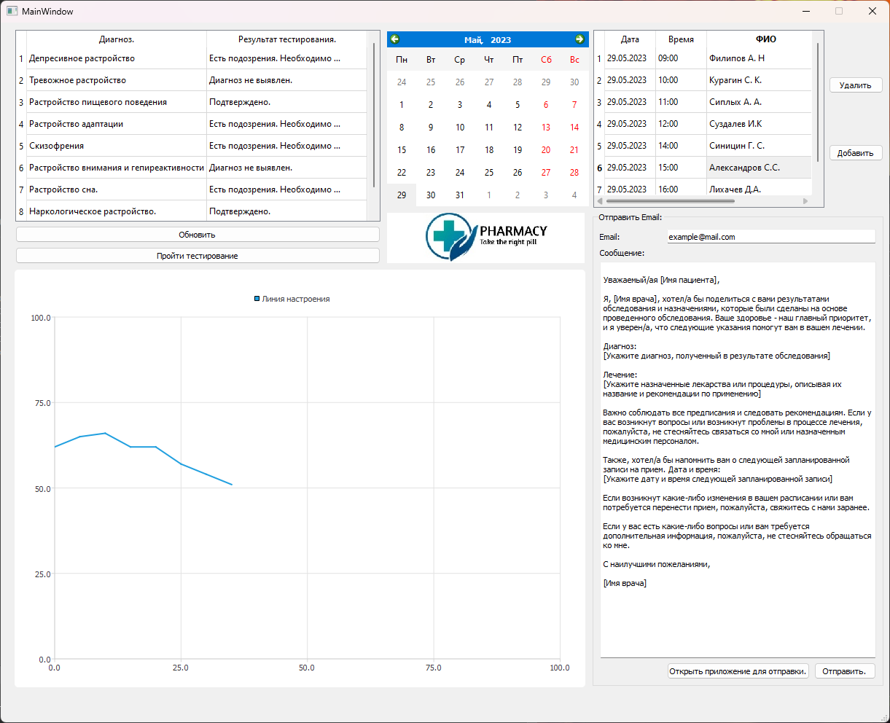
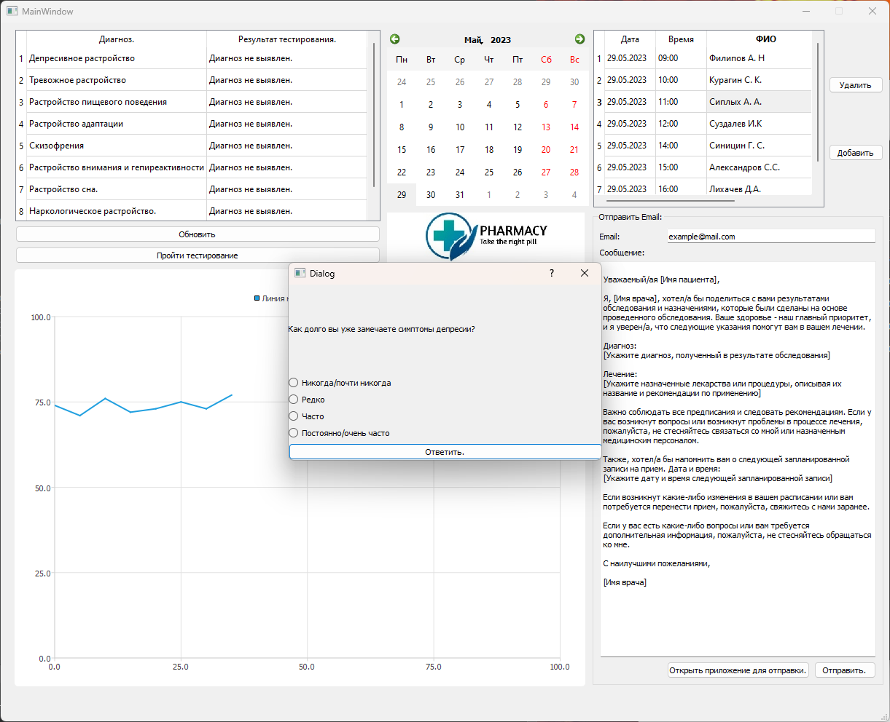

# Автоматизированное рабочее место специалиста
## Постановка задачи
Реализовать автоматизированное рабочее место специалиста (АРМ) - психолога/психотерапевта.
Данное АРМ должно выполнять функции:
- Опросник.
- Отправка Email сообщений для связи с пациентом
- Хранить список записанных пациентов, а также взаимодействовать с данным списком.
- Представлять график для отображения депресивного состояния каждого пациента.
- Программа должна управляться событиями.

## Анализ задачи
- Для управления событиями будет использоваться фреймворк QT. Данный фреймворк предоставляет большое количество встроенных методов и библиотек, которые сильно ускорят разработку программы.
- Для создания опросника можно использовать отдельное окно, которое будет отправлять сигналы на главное окно и изменять данные в нем. Для вынесения диагноза будет строиться таблица (дигноз - результат), в которой будет явно прослеживаться болезнь. Опросник будет работать на текущего клиента, который 
- Необходимо реализовать дополнительную форму для отправки Email. В данной форме будет стандартный шаблон, который можно будет редактировать. Таким образом можно ускорить и улучшить качество информирования клиента. Для отправки Email будет использовать ```QTcpSocket``` и ```SMTP``` сервер ```gmail```. Через сокет будут отправляться команды на сервера, а также данные, которые необходимо передать.
- Для того, чтобы хранить список записанных пациентов будет использованна ```QSQLite``` база данных. В данной базе данных будут реализованы поля для хранения даты записи, времени записи, ФИО, а также результаты ежедневного тестирования. При выводе данных в приложение необходимо написать ```SQL``` запрос, который будет откидывать данные для построения графика, а также показывать клиентов на определенное число.
- Для построения графика использовать базу данных, для этого написать ```SQL``` запрос, который будет выдавать данные для построения графика. График будет строиться с помощью втроенной библиотеки ```QtCharts```. 

## Тестирование
Программа выполнена модульно, поэтому для выполнения тестирования необходимо протестировать отдельно взятые методы.
Тестирование программы представленно в видео на YouTube: <ссылка>


## Сборка и запуск
Для того, чтобы запустить данную программу необходимо склонировать репозиторий:
```
gh repo clone der-i/SalesmanProblem-and-ARM
```
Далее открыть файл ```.\ARM\ARM.pro``` и скомпилировать программу. Для корректного запуска необхоима стандартная поставка QT версии ```QT5.12.12```


## Выполнение программы





## Исходный код

Исходный код представлен в репозитории: https://github.com/der-i/SalesmanProblem-and-ARM

## Разработчики

Проект разработал: студент ПНИПУ гр. РИС-22-1б Деревнин Илья Вячеславович 
Контактные данные: derevnin05@gmail.com