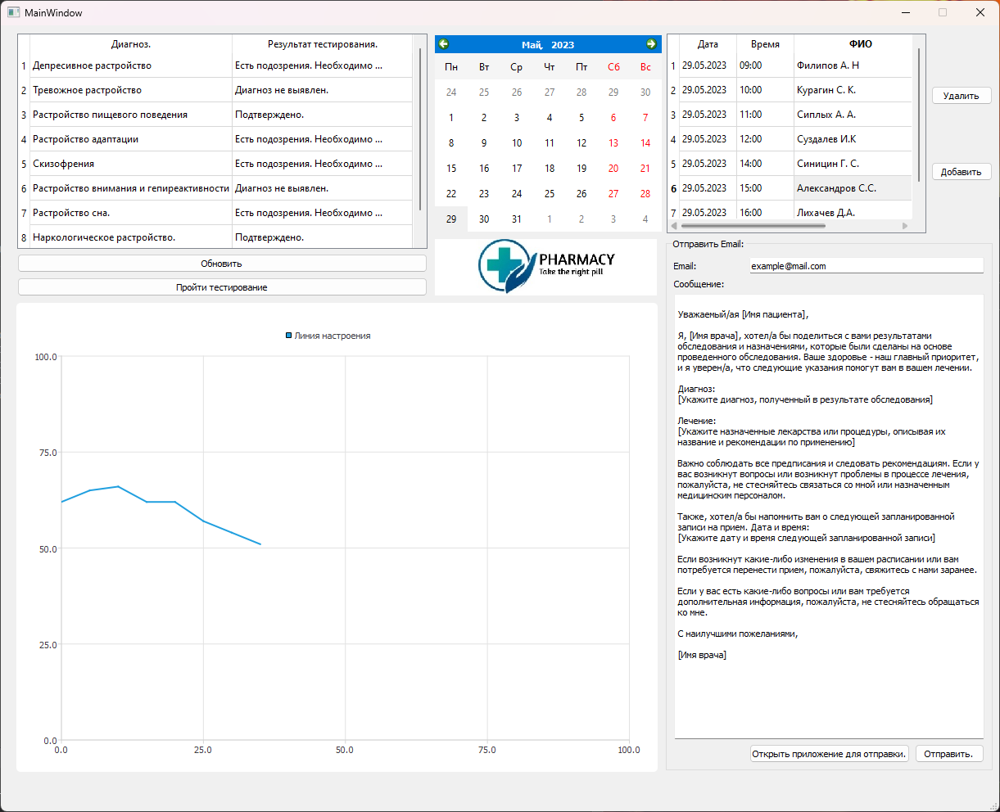
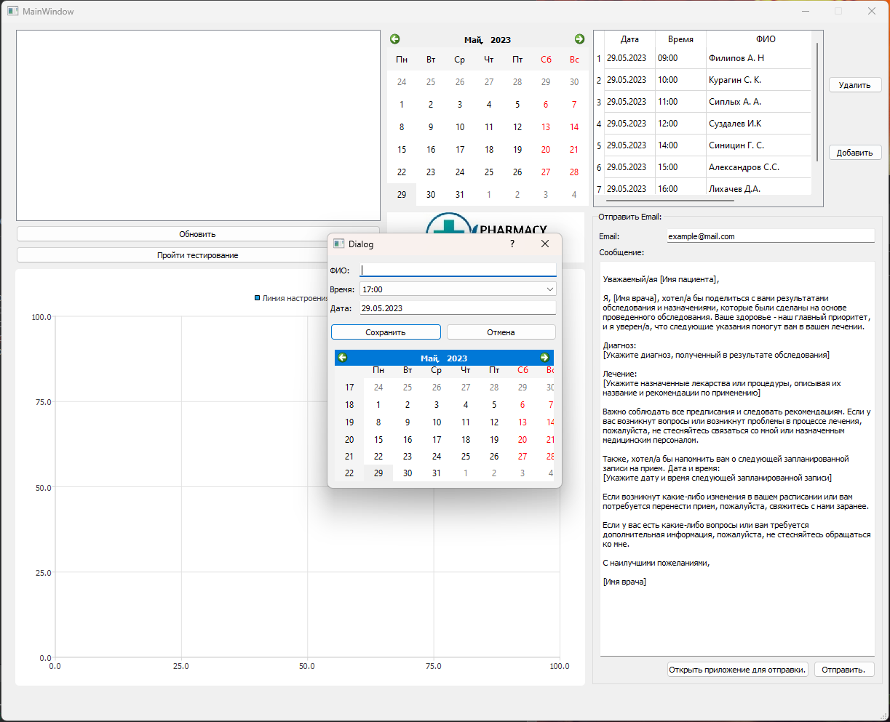
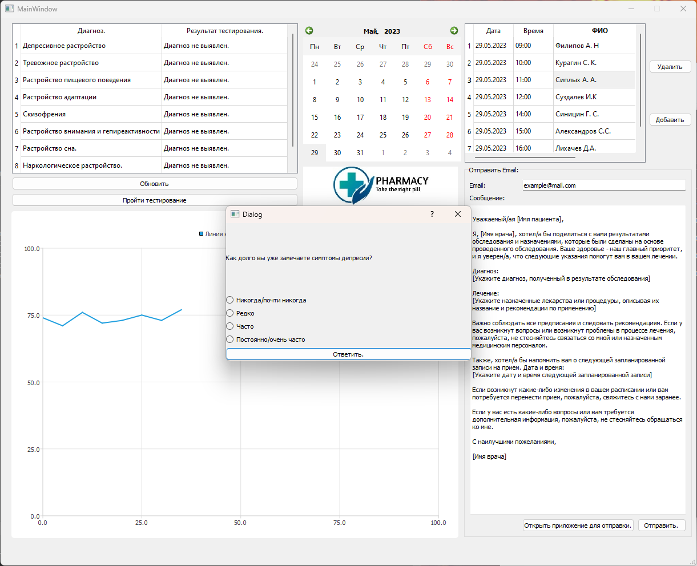
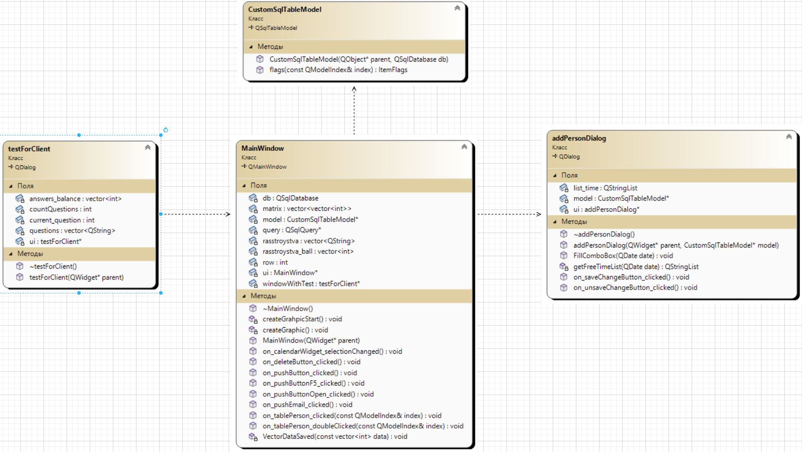

# Автоматизированное рабочее место специалиста
## Постановка задачи
Реализовать автоматизированное рабочее место специалиста (АРМ) - психолога/психотерапевта.
Данное АРМ должно выполнять функции:
- Управление событиями.
- Отправка Email сообщений для связи с пациентом.
- Хранение списка записанных пациентов, а также взаимодействие с ним.
- Представление графика для отображения депресивного состояния каждого пациента.
- Опросник.

## Анализ задачи
- Для управления событиями использован фреймворк QT. Данный фреймворк предоставляет большое количество встроенных методов и библиотек, которые сильно ускоряют разработку программы.
- Для создания опросника используется отдельное окно, которое отправляет сигналы на главное окно и изменяет данные в нем. Для вынесения диагноза строиться таблица (дигноз - результат), в которой явно прослеживается болезнь. Опросник работает на текущего клиента, который непосредственно находится у врача.
- Реализация дополнительной формы для отправки Email. В данной форме находится стандартный шаблон, который можно редактировать. Таким образом можно ускорить и улучшить качество информирования клиента. Для отправки Email используется ```QTcpSocket``` и ```SMTP``` сервер ```gmail```. Через сокет отправляются команды на сервер, а также данные, которые необходимо передать.
- Для хранения списка записанных пациентов использованна ```QSQLite``` база данных. В данной базе данных реализованы поля для хранения даты и времени записи, ФИО, а также результаты ежедневного тестирования. При выводе данных в приложение необходимо использовать ```SQL``` запрос, который выбирает нужные данные для построения графика, а также показывать клиентов на определенное число.
- Для построения графика использовать базу данных, для этого написать ```SQL``` запрос, который будет выдавать данные для построения графика. График будет строиться с помощью втроенной библиотеки ```QtCharts```. 

## Тестирование
Программа выполнена модульно, поэтому для выполнения тестирования необходимо протестировать отдельно взятые методы.
Тестирование программы представленно в видео на YouTube: https://youtu.be/jV-2TeJ0yfI


## Сборка и запуск
Для того, чтобы запустить данную программу необходимо склонировать репозиторий:
```
gh repo clone der-i/SalesmanProblem-and-ARM
```
Далее открыть файл ```.\ARM\ARM.pro``` и скомпилировать программу. Для корректного запуска необходима стандартная поставка QT версии ```QT5.12.12```


## Выполнение программы

Рис. 1 - Стартовое меню.

Рис. 2 - Окно добавление пациента.

Рис. 3 - Окно опросника.

Рис. 4 - Диаграмма классов.



## Исходный код

Исходный код представлен в репозитории: https://github.com/der-i/SalesmanProblem-and-ARM/tree/main/ARM