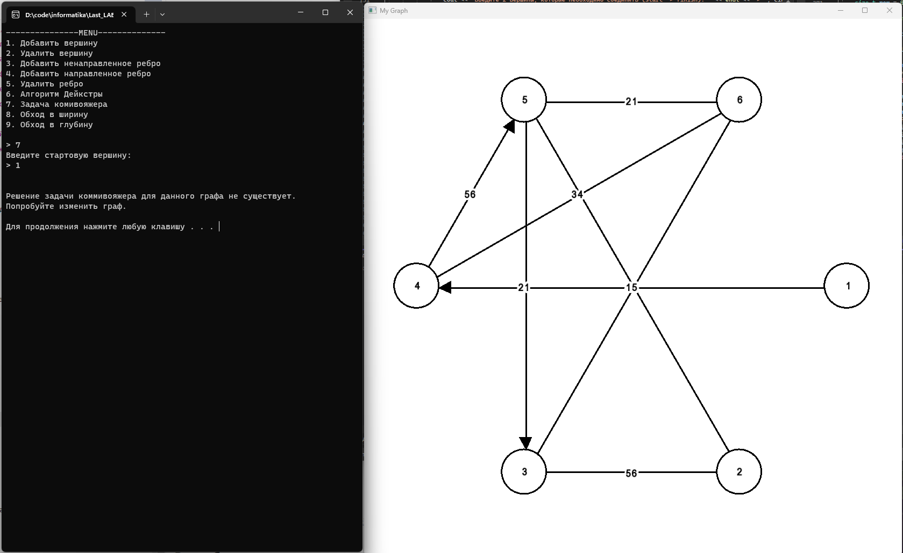
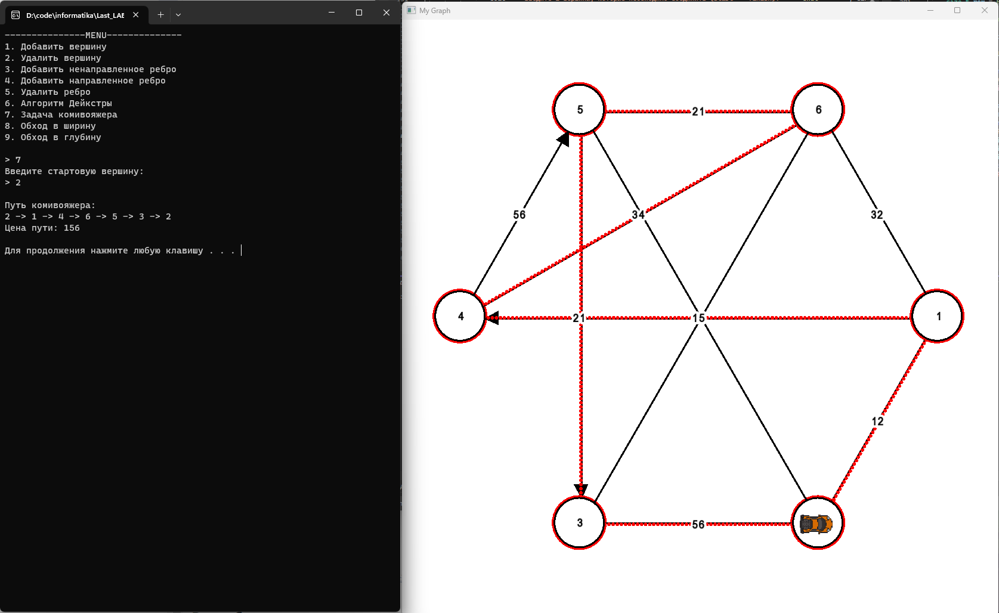
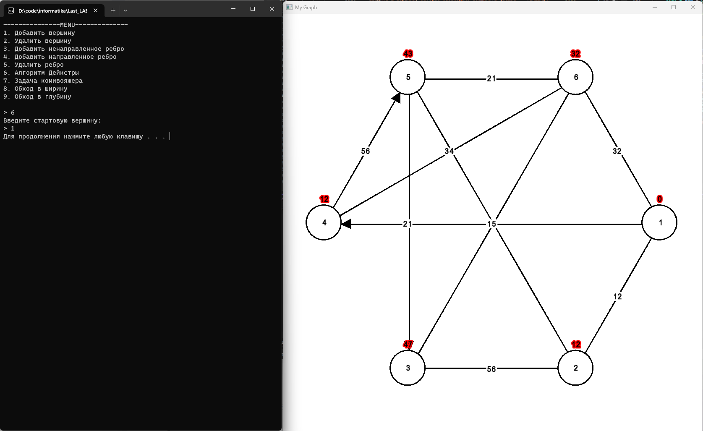
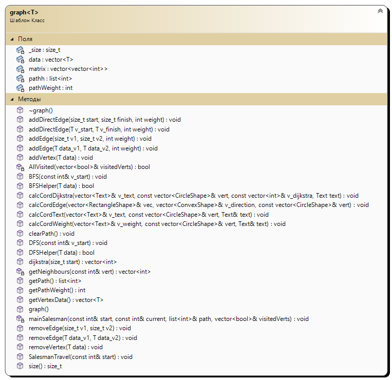

# Задача комивояжера
## Постановка задачи
Реализовать граф и решить для него задачу Комивояжера методом ветвей и границ.
Для решения данной задачи необходимо:
- Создать класс Graph.
- Решить для данного графа задачу Комивояжера.
- Визуализировать граф.
- Визуализировать решение задачи Комивояжера.

## Анализ задачи
- Базовый класс ```Graph``` взят из лабораторной работы графы. Граф хранится в виде массива с наименованием вершин и матрицы смежности. В графе реализованы методы для создания вершин, направленных и ненаправленных ребер. 
- Для решения задачи комивояжера будет использоваться метод ветвей и границ, который будет находить локально-оптимальное решение для данного графа. Но при решении будут внесены правки - такие как установка стартовой вершины. Для этого принудительно добавляется вершина в список, который представляет из себя маршрут по вершинам. Если задачу невозможно решить для данного графа, то есть одна или несколько вершин не достижимы, то решения не будет и высветится подскаска, что необходимо отредактировать граф.
- Для визуализации будет использовать библиотека ```SFML``` Вершины графа будут отрисовываться по кругу, от вершины к вершине будет идти ребро в виде узкого прямоугольника. Если ребро направленное, то на будет отрисован треугольник указывающий направление. Также по середине ребра будет располагаться его вес, а на вершинах название вершин.
- Для визуализации решения задачи Комивояжера будет отрисовываться спрайт, который относительно времени будет перемещаться по графу. За спрайтом будет отображаться его путь с помощью маленьких кружков. 
 

## Тестирование
Для тестирования программы необходимо протестировать решение решение задачи и визуализацию на разном количестве вершин, а также на разных типах ребрах.
Тестирование программы представленно в видео на YouTube: https://youtu.be/sMJkvukl690


## Сборка и запуск
Для того, чтобы запустить данную программу необходимо склонировать репозиторий:
```
gh repo clone der-i/SalesmanProblem-and-ARM
```
Далее открыть файл ```./Graph.sln``` и скомпилировать программу.

## Выполнение программы


Рис. 1 - Невозможно решение задачи Комивояжера.

Рис. 2 - Визуализация решения задачи Комивояжера

Рис. 3 - Визуализация влгоритма дейкстры.

Рис. 4 - Диаграмма классов.
## Исходный код

Исходный код представлен в репозитории: https://github.com/der-i/SalesmanProblem-and-ARM/tree/main/GRAPH
